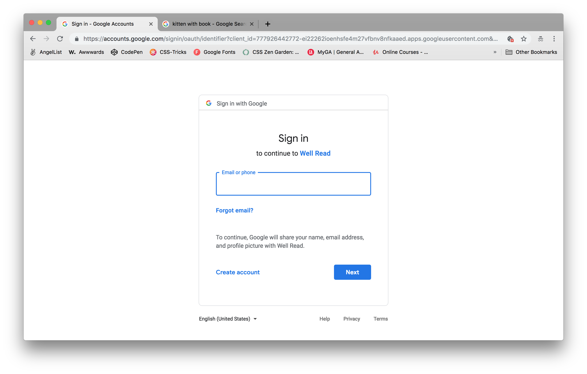
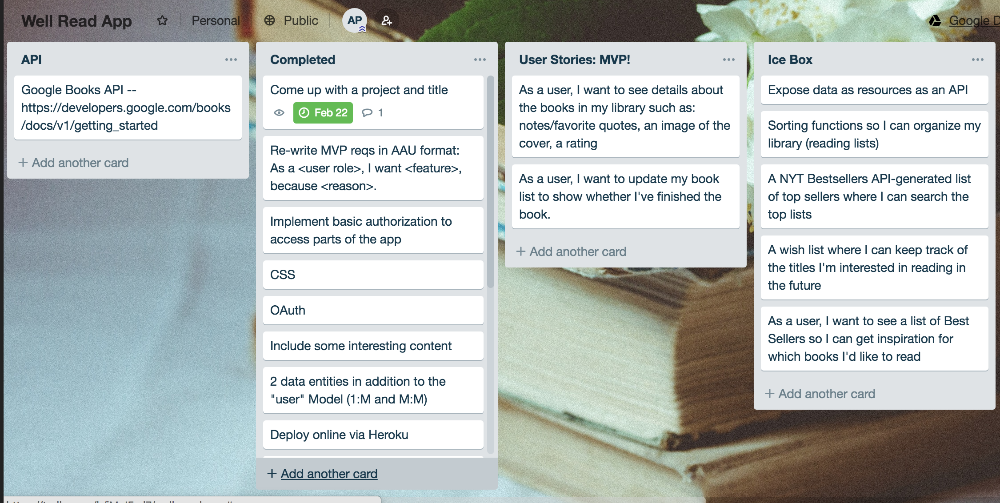
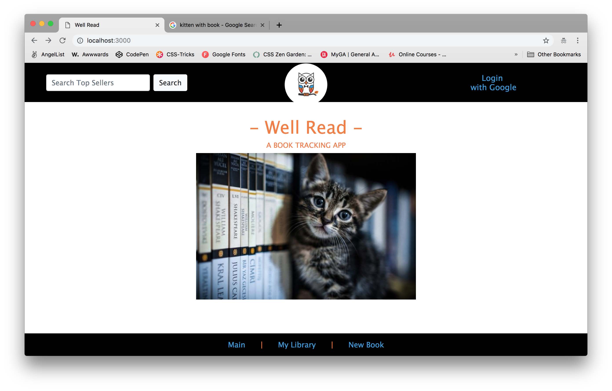
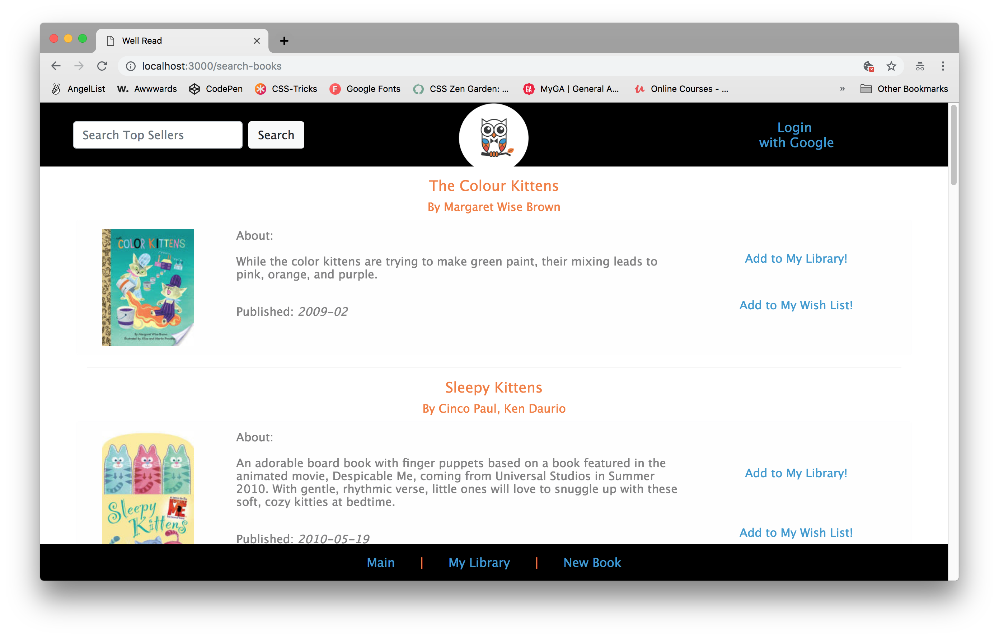
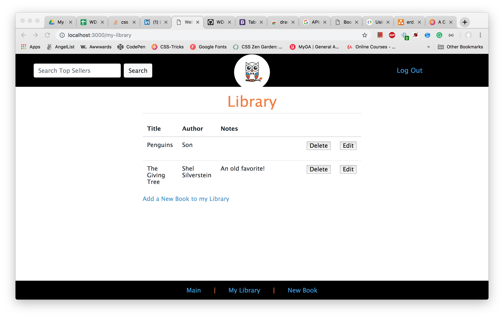
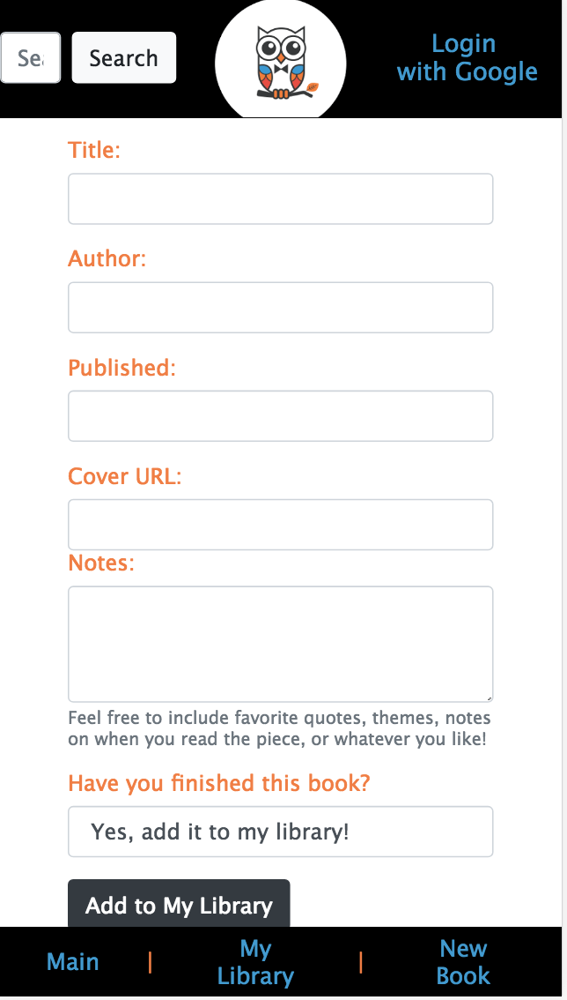
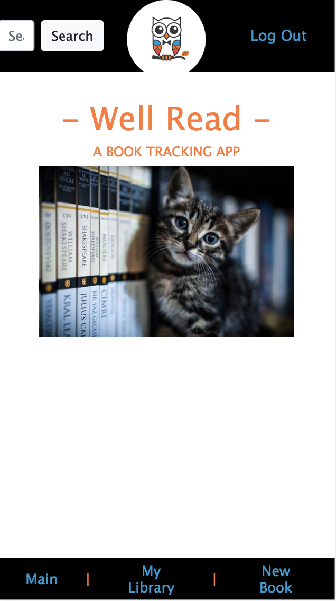

# Well Read
## by Anna Peterson, Web Developer
<annapeterson89@gmail.com>

## Description

Well Read is an app for users to track the books they read and keep reviews, quotes, and other notes on their favorite literature. 


## Wireframes


 

## Planning
### Trello
I used Trello to come up with some User Stories for Well Read. 
 
<https://trello.com/b/jMrJFzd7/well-read-app>

### ERD (Entity Relationship Diagram)

 

As you can see in the diagram above, in Well Read every user will get a library. For the purposes of my app, *a user is a library* with: 

	* A name
	* A Google ID 
	* Books

The books are embedded in the library Schema and contain these values: 

	* Title
	* Author
	* Cover
	* Published
	* Notes


## API

### Not all APIs are equal

After looking at the NYT books API, I ultimately went with Google Books because it has **extensive documentation**. Check it out at: <https://developers.google.com/books/docs/v1/getting_started>

Just for fun, let's preview the table of contents for Google's documentation: 

 

Very documented!

How about the NYT Books table of contents? Well, they don't exactly have a Table of Contents, but they do have *this*:

 

<https://developer.nytimes.com/>

The New York Times API also had higher security. I wanted my users to have unlimited acces to a broad range of titles. In the future, I would like to integrate the NYT Best Sellers list seperately from the main books search, but for my initial launch, Google Books had everything a user could ask for. 


### Taming the API

Google's API delivers, but it's a bit like asking for a cup of coffee and getting the entire cafe. The objects Google returns are **huge** complete with lots of fun information about every book. Let's look at my `bookData.items[0]` when I search for _The Giving Tree_: 

``` 
{ title: 'The Giving Tree',
authors: [ 'Shel Silverstein' ],
  publisher: 'Harper Collins',
  publishedDate: '2014-02-18',
  description:
   "As The Giving Tree turns fifty, this timeless classic is available for the first time ever in ebook format. This digital edition allows young readers and lifelong fans to continue the legacy and love of a household classic that will now reach an even wider audience. Never before have Shel Silverstein's children's books appeared in a format other than hardcover. Since it was first published fifty years ago, Shel Silverstein's poignant picture book for readers of all ages has offered a touching interpretation of the gift of giving and a serene acceptance of another's capacity to love in return. Shel Silverstein's incomparable career as a bestselling children's book author and illustrator began with Lafcadio, the Lion Who Shot Back. He is also the creator of picture books including A Giraffe and a Half, Who Wants a Cheap Rhinoceros?, The Missing Piece, The Missing Piece Meets the Big O, and the perennial favorite The Giving Tree, and of classic poetry collections such as Where the Sidewalk Ends, A Light in the Attic, Falling Up, Every Thing On It, Don't Bump the Glump!, and Runny Babbit. And don't miss Runny Babbit Returns, the new book from Shel Silverstein!",
  industryIdentifiers:
   [ { type: 'ISBN_13', identifier: '9780061965104' },
     { type: 'ISBN_10', identifier: '0061965103' } ],
  readingModes: { text: true, image: true },
  pageCount: 64,
  printType: 'BOOK',
  categories: [ 'Juvenile Fiction' ],
  averageRating: 4,
  ratingsCount: 4805,
  maturityRating: 'NOT_MATURE',
  allowAnonLogging: true,
  contentVersion: '1.3.3.0.preview.3',
  panelizationSummary: { containsEpubBubbles: false, containsImageBubbles: false },
  imageLinks:
   { smallThumbnail:
      'http://books.google.com/books/content?id=1IleAgAAQBAJ&printsec=frontcover&img=1&zoom=5&edge=curl&source=gbs_api',
     thumbnail:
      'http://books.google.com/books/content?id=1IleAgAAQBAJ&printsec=frontcover&img=1&zoom=1&edge=curl&source=gbs_api' },
  language: 'en',
  previewLink:
   'http://books.google.com/books?id=1IleAgAAQBAJ&printsec=frontcover&dq=the+giving+tree&hl=&cd=1&source=gbs_api',
  infoLink:
   'https://play.google.com/store/books/details?id=1IleAgAAQBAJ&source=gbs_api',
  canonicalVolumeLink: 'https://market.android.com/details?id=book-1IleAgAAQBAJ' } 
  ```
  
As a user, I'm not interested in who the publisher was or seeing a lot of links and I don't care what the ISBN is. Well Read is for book tracking so I only really care about the title, author, a description, and how the cover looks. For fun, let's grab the publishing date as well. But WAIT! Some books don't have Authors and some of Google Book's results didn't provide links to a thumbnail of the cover! As I searched for random terms, I found out that my app would break if the data didn't provide every value I was querying for! Have no fear, ReadMe reader! We can fix it! After investigating various approaches to dealing with my dirty data, the best solution was to write a function that would look at my data, determine what I was dealing with, and provide the correct output for each item. As a user, I wanted to see 'By Author Unknown' if there was one author I wanted to see 'By Author van Author" and if there was more than one author I would like to see "By Author, Author van Author, Author McAuthor"

``` 
function authorParser(book) {
    return book === undefined ? 'Author Unknown' : 
    book.length === 1 ? book.toString() : book.join(', ');
  };
```

```

function imgParser(data) {
    return data === undefined ? "/images/no-img.png" : data.thumbnail;
  }; 
``` 

I passed these functions into my render functions as methods and called them in the .ejs for our search! This will keep the search from breaking if the API doesn't have the key value pair you're looking for. **This is a great way to handle dirty data!**

## CRUD Operations

	* Create -- add a new book to the library
	* Read -- see items in the library AND view books through the API
	* Update -- edit books in the library
	* Delete -- Remove an item from the library

## OAuth
As a user, I want to be able to have continued access to my library and all its books! This requires a unique user ID. One of the best ways to implement a feature like this is with Google's OAuth API.

Check it out:
 
<https://console.developers.google.com/apis/dashboard?project=well-read-232620&folder=&organizationId=>

This can require a lot of tinkering and a problem for developers is having to log in over and over again as we try restart our servers during the development process. One trick I used to avoid this was turning the function I was working on into a login button that would automatically log me in if I wasn't already. In my code it looks like this: 

```

function index(req, res, next) {
    req.user == null ? res.redirect('/auth/google') :
    Library.findOne({_id: req.user.id})
    .populate('books')
    .exec((err, bookies) => {
        res.render('library/my-library', {
            user: req.user,
            name: req.query.name,
            books: bookies.books
            });
        })
    
};

```

The result is that if I try accessing My Library without being logged in, I get re-directed to the login page *or* I am automatically logged in if that's possible. 

 

## Database

I used Mongo Atlas for my database! It's free and easy to use! 

<https://cloud.mongodb.com>

## Results

My Trello board after one week.


### Home Page

 

### Searching the API

 

### My Library 

 

### Mobile
#### Entering a New Book

 

#### Home Page



## Check it out! 

<https://well-read-app.herokuapp.com/>
<https://github.com/annaelizabeth2019/well-read>

_______________________
Thank you for reading my ReadMe!
	